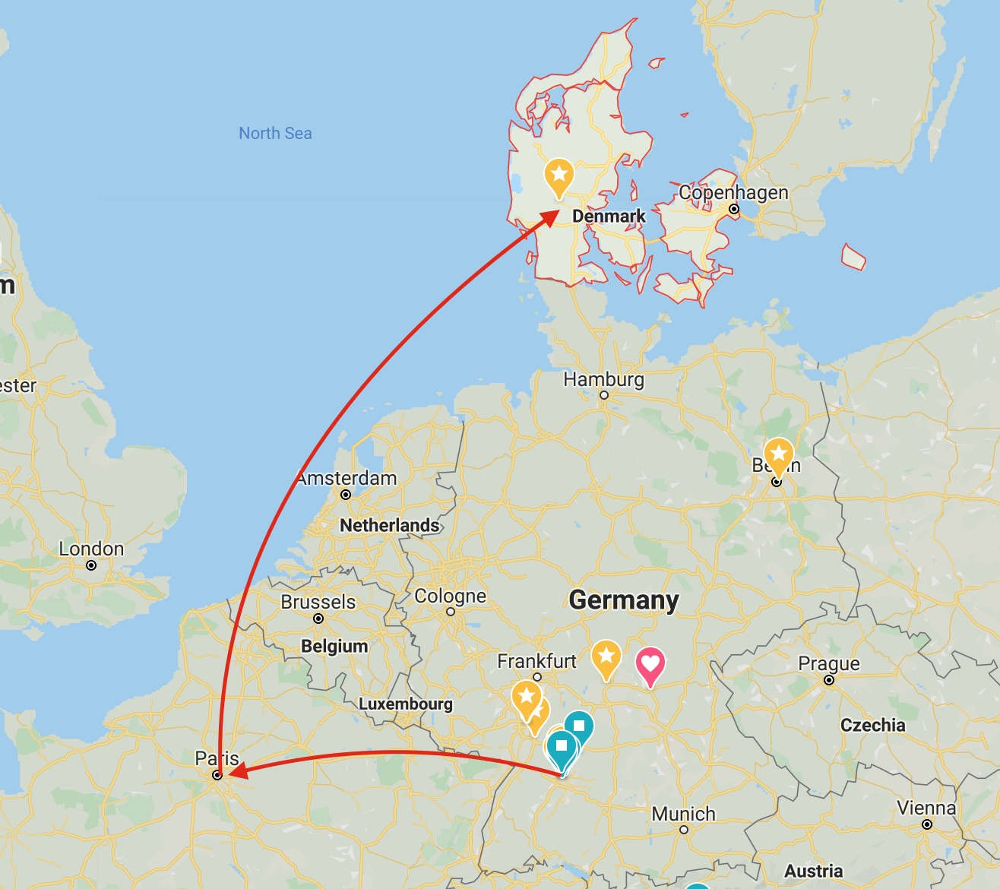
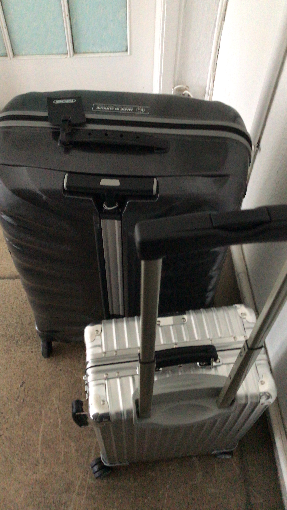
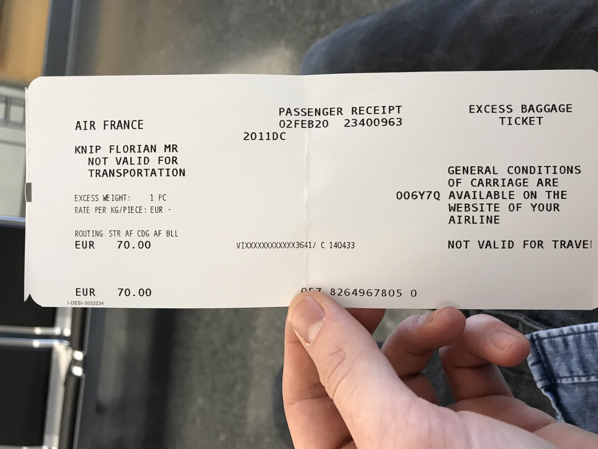
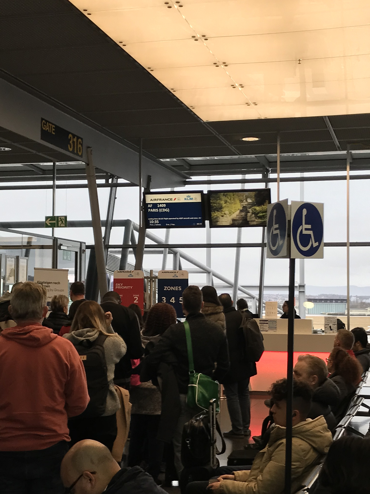
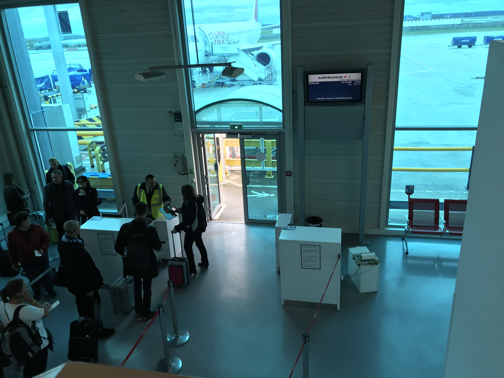

Stuttgart, erster Februar 2020, in zwei Tagen geht es los. Einmal wieder heißt es "Adee" sagen; diesmal zu Maultaschen und Spätzle. Die zwei Koffer gepackt (mehr darf man nicht in den Flug mitnehmen) und vollgestopft mit allen Sachen, die ich meine zu brauchen für die ersten Wochen, bzw. Monate. Ein paar Büro-Outfits Sportsachen (Wer weiß, wann ich das erstem mal Gelegenheit zum Waschen bekomm), Laptop, Kabelwerk, ganz wichtig: die neu gekaufte Regenjacke. Das Wetter in Dänemark um die Jahreszeit soll ungemütlich und regnerisch sein, um die 10 Grad.

Der Flug geht von Stuttgart über Paris nach Billund in Dänemark. Billund ist auch gleichzeitig der Ort des Headquartes meines neuen Arbeitgebers, Lego. Lego der Spielzeughersteller. Habe mich Ende des Jahres dazu entschieden mir einen langen Traum nachzugehen, nämlich einmal im Ausland in einem fremden Land, einer anderen Kultur zu arbeiten. So wird aus einer etwas verrückten Idee eine Online-Bewerbung, aus einer Bewerbung eine Einladung mit Interview, aus einem Interviewgespräch eine ernsthafte Überlegung, ob man es machen soll. Warum sollte man etwas vermeintlich Gutes aufzugeben und etwas neues riskieren von dem man nicht genau weiß, was es bringt. Da man nicht alles haben kann muss man sich dann noch entscheiden. In meinem Fall hieß das den alten Job und Stuttgart den Rücken zu kehren auf nach Dänemark zu LEGO. 
<--Hier noch ein Übergang->
Alle Fragen sollten jetzt geklärt sein: Wie läuft das mit der Krankenversicherung? Wie viel Urlaub werde ich dieses Jahr haben. Wie komme ich jeden Tag zur Arbeit? Brauche ich ein Auto? Ab wann bekommt man ein Bankkonto. 

