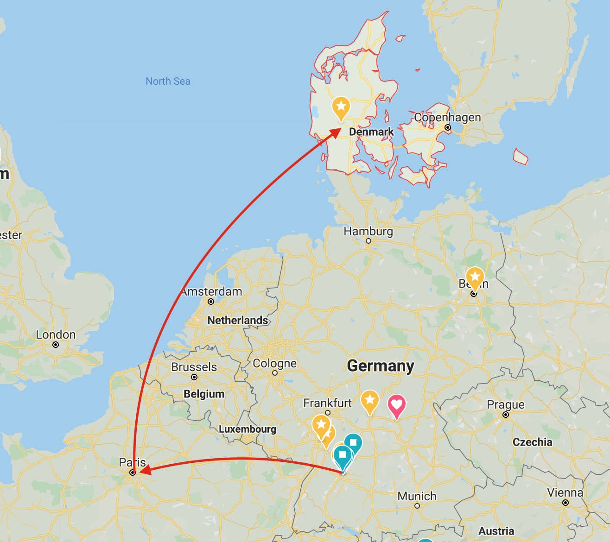
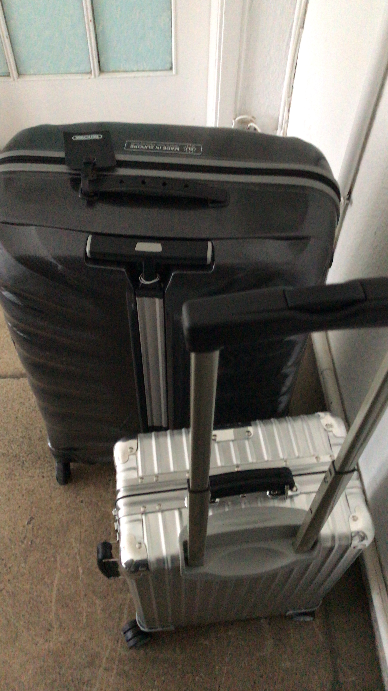
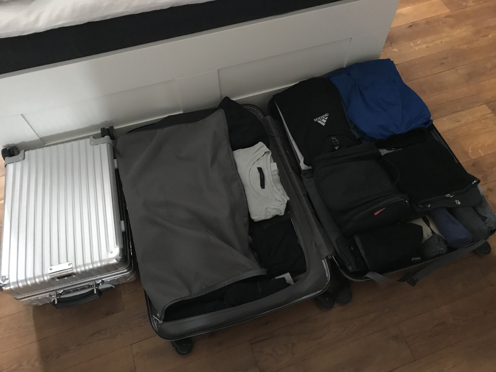
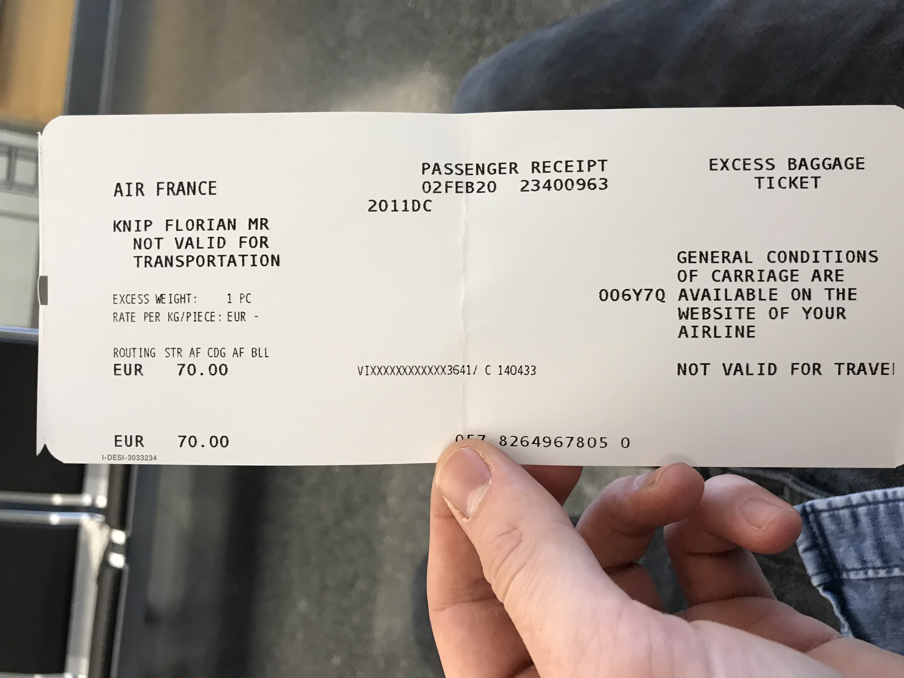
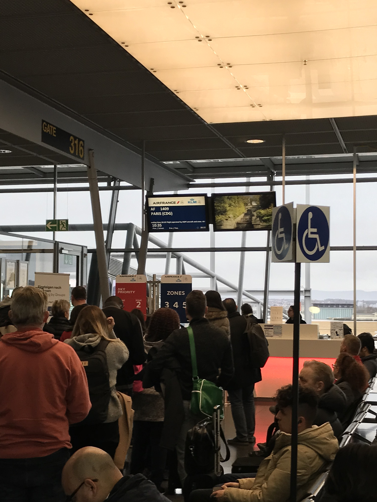
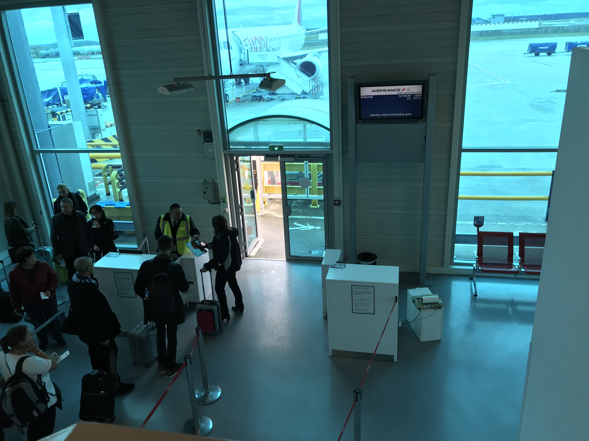

Stuttgart, erster Februar 2020, in zwei Tagen geht es los. Einmal wieder heißt es "Adee"; diesmal zu Maultaschen und Spätzle. Die zwei Koffer gepackt - mehr darf man nicht in den Flug mitnehmen - und vollgestopft mit allen Sachen, die ich meine für die ersten Wochen, bzw. Monate zu brauchen. Ein paar Büro-Outfits, Sportsachen (Wer weiß, wann ich das erste mal Gelegenheit zum Waschen bekomme), Laptop, Kabelwerk, ganz wichtig: die neu gekaufte Regenjacke. Das Wetter in Dänemark um die Jahreszeit soll ungemütlich und regnerisch sein: Um die 10 Grad.

Der Flug geht von Stuttgart über Paris nach Billund in Dänemark. In Billund ist auch gleichzeitig das Headquartes meines neuen Arbeitgebers, Lego. 

Wie ist es dazu gekommen? Habe schon längerer Zeit den Wunsch, bzw. den Traum gehabt, im Rahmen meines gelernten Berufs im Ausland arbeiten, ein anders Land und dessen Kultur kennenlernen und dort leben. Ende des Jahres habe ich die Gelegenheit bekommen und mich dann dazu entschieden, den Traum wahrzumachen.
<!---
So wurde aus einem Traum, eziehungsweise einer etwas verrückten Idee eine Online-Bewerbung, aus einer Bewerbung eine Einladung mit Interview, aus einem Interviewgespräch eine ernsthafte Überlegung, ob man es machen soll. Warum sollte man etwas vermeintlich Gutes, das man sicher hat aufzugeben und etwas neues riskieren von dem man nicht genau weiß, was es bringt. Da man bekanntlich nicht alles haben kann, muss man sich dann noch entscheiden. In meinem Fall hieß das den alten Job und Stuttgart den Rücken zu kehren auf nach Dänemark zu LEGO.  -->
Spätestens jetzt sollten alle Fragen sollten jetzt geklärt sein: Wie läuft das mit der Krankenversicherung in Dänemark? Wie viel Urlaub werde ich dieses Jahr haben. Wie komme ich jeden Tag zur Arbeit? Brauche ich ein Auto? Ab wann bekommt man ein Bankkonto.  - Von wegen! Alles was ich weiß ist, dass der große Umzug der Wohnung in Stuttgart im Laufe des Jahres abgewickelt werden soll, dass ich die ersten Woche im Hotel unterkomme und die Adresse des Gebäudes bei dem ich mich am Montag, den 2.2.2020 um 08:30 Uhr für die "Induction Days" einfinden soll.  

Los geht's. :P

