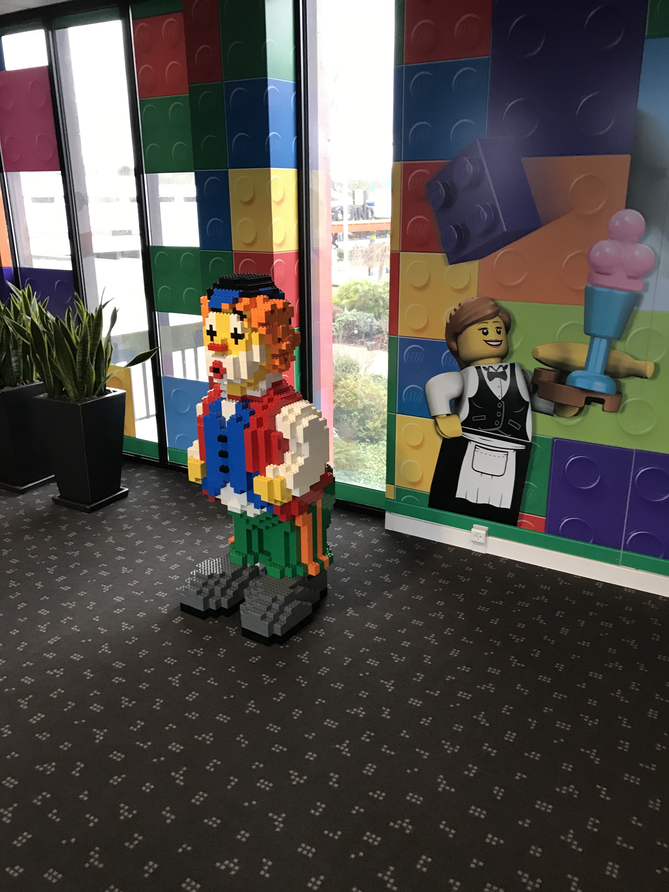

Da meine meine temporäre Wohnung noch nicht von Anfang an frei war, musste ich erst mal zehn Tage ins Hotel. Das Hotel sollte ca. 15 Minuten von meinem Büro entfernt sein - zumindes laut Google Maps.

So kam ich Sonntag Abend am [Billund Airport](https://de.wikipedia.org/wiki/Flughafen_Billund) an. Da ich fürs Interview sowie einen weiteren Besuch schon mal da war, kannte ich den Flughafen bereits ganz gut. Ich war also nicht mehr überrascht von dem Fun Fact, dass es sich um den zweitgrößten Flughafen in Dänemark nach Kopenhagen handelt. Ursprünglich gebaut und im Besitz von Lego und irgendwann an den dänischen Staat übergeben ist man in Billund stolz Direktflüge beispielsweise nach New York oder Barcelona anbieten zu können. Die Freude kann meinem Anschein nach auch die Diskussion um Umwelt- und Klimaschutz nicht wirklich trüben.

Der Flughafen liegt ca. 10 Autominuten vom Billund Zentrum entfernt. Obwohl auch ein Bus nach rein fährt, hab ich mir zusammen mit den Koffern lieber ein Taxi gegönnt und mich vors Hotel fahren lassen. 

[Hotel Legoland](https://goo.gl/maps/qJYUALVSDJvc1Yei6). Mega! Da das Legoland um die Jahreszeit noch nicht geöffnet hat, war ich auch so ziemlich der einzige Gast, der am Sonntag Nachmittag eingechecken wollte. Schon vor dem Gebäude wird man von dem lauten Schnaufen eines riesigen grünen Legodrachens begrüßt, der über dem Eingangsbereich sitzt und auf einen herabschaut. Im Eingangsbereich der Lobby spielt klassiche Freizeitpark Dudelmusik.  Natürlich keine Warteschlange an der Rezeption. Die Frau an der Rezeption steht bereit, begrüßt mich freundlich und erklärt mir, dass sie ein Zimmer mit "Parkview" für mich hat.  Tatsächlich kann ich von dem Zimmer aus den Legoland Park schauen, das im Februar natürlich noch im Winterschlaf liegt. Wer schon mal dort war, kommt manches vielleicht bekannt vor. Seht einfach selbst.

