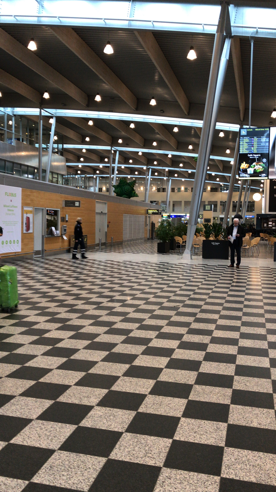
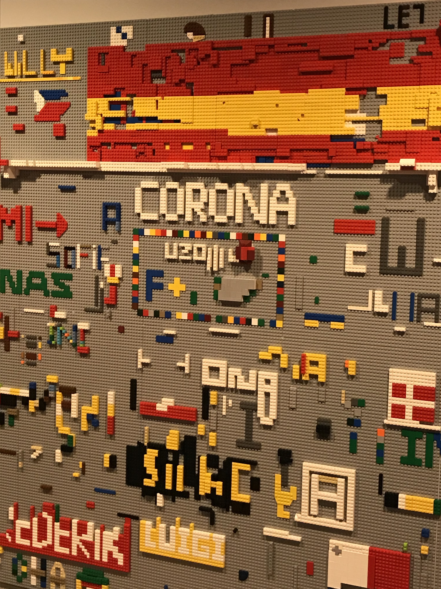
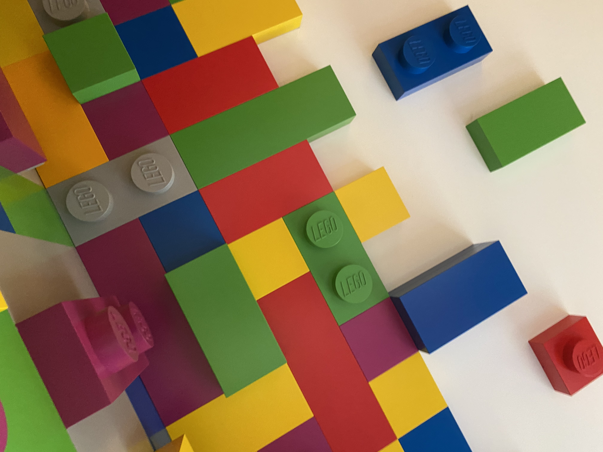
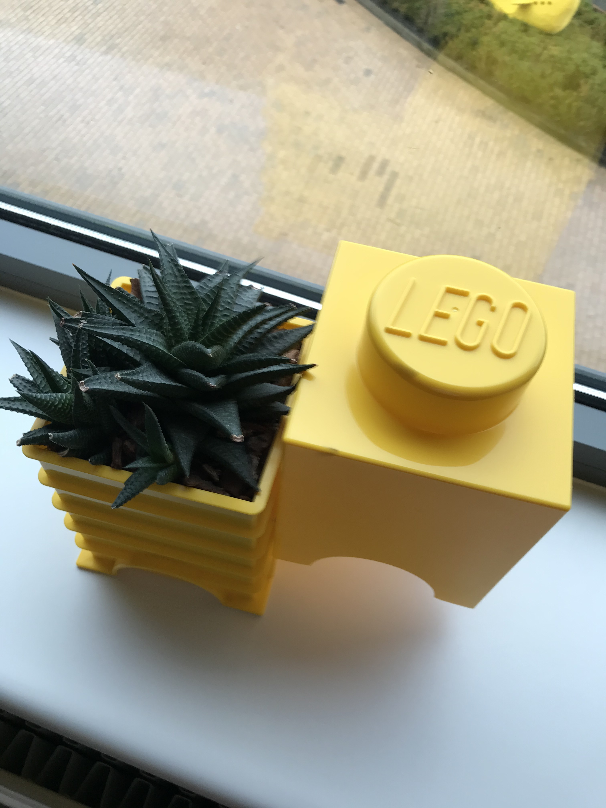
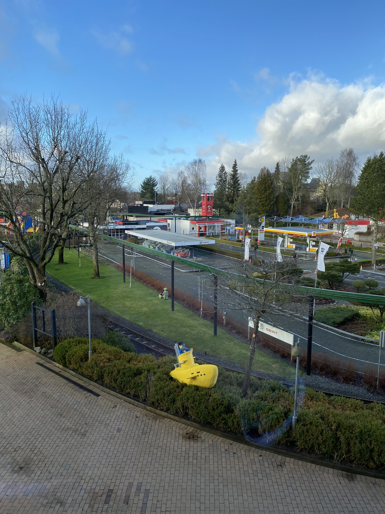

Da mein Zimmer für die temporäre Wohnung noch nicht von Anfang an frei war, musste ich erst mal zehn Tage ins Hotel. Ca. 15 min von meine Büro entfernt. So kam ich Sonntag Abend am Billund Airport an. Da ich fürs Bewerbungsgespräch und für einen weiteren Besuch danach bereits schon mal da war kannte ich den Flughafen bereits ganz gut. Fun Fact: Billund Airport ist der zweitgrößte Flughafen in Dänemark nach Kopenhagen. Ursprünglich gebaut und im Besitz von Lego und irgendwann an den dänischen Staat übergeben ist man hier stolz auf Direktflüge nach New York oder Barcelona anbieten zu können. 

Jedenfall erst mal checkin ins Hotel. Hotel Legoland. Ganz toll! Und Zimmer mit Parkview. Also Aussicht auf den Legoland Park, das im Februar natürlich noch im Winterschlaf geschlossen ist. Wer schon mal dort war, kommt manches vielleicht bekannt vor. Seht einfach selbst auf den Bildern:

