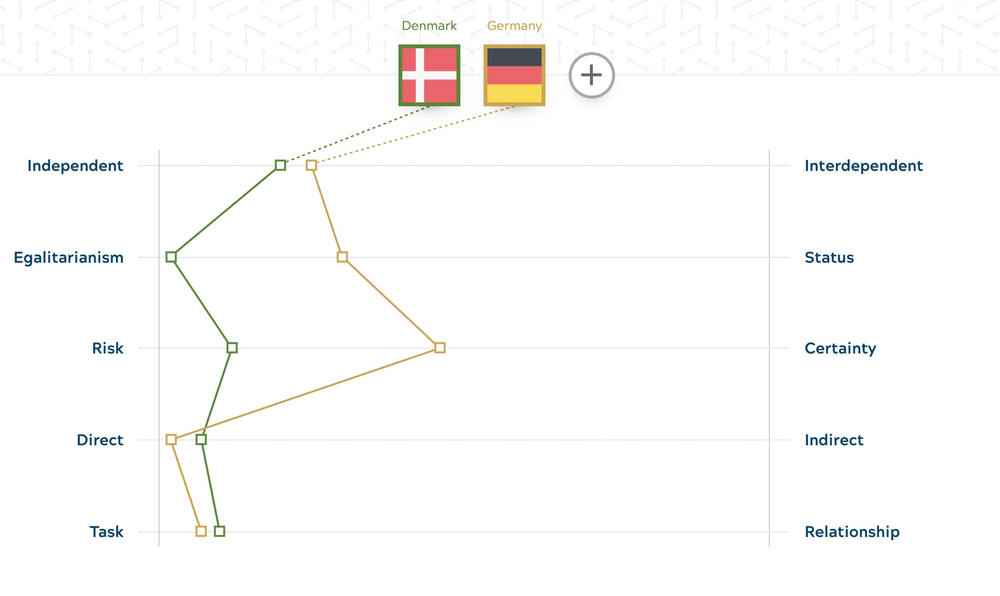
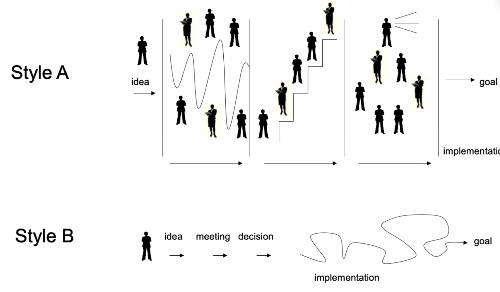

<!-- 

Kultur entschlüsslen

Obwohl Dänemark als Nachbarland von Deutschland geographisch nicht weit entfernt ist, scheint es Vielen - zumindest mir - kulturell vergleichsweise weit weg und auch unbekannt. In meinem Kopf ist es immer eher den skandinavischen Ländern Dänemark, Schweden, Norwegen zugeordnet. Also klar Teil der westlichen Kultur und Teil von Europa, aber trotzdem irgendwie mit einer Sonderstellung im Vergleich zum Rest des Westens und der EU. "Die Skandinavier machen halt ihr Ding" so die Denke bei mir. Oft werden in Diskussionen über Themen des gesellschaftlichen Zusammenlebens - z.B. Genderthemen, Digitaliseirung, Kindererziehung, oft "Die Skandinnavier" als fortschrittliches Vorbild aufgeführt, um das eigene Argument zu untermauern. Witzigerweise wird das Argument vom  Vertreter der Gegenposition dann auch in der Folge nicht mehr angegriffen - quasi ein nerviges Totschlag-Argument, das jeder kennt :-D. 

Warum das ist so? Meine Antwort bis jetzt: Keine Ahnung! Hoffe, ich finde es noch heraus im Laufe der Zeit. Was ich allerdings schon klar sagen kann: Manche Sachen laufen hier einfach anders. Beziehe mich damit auf den Alltag im Büro, bzw. bei der Arbiet, wo ich ja doch mit die meiste Zeit verbringe. 

In der täglichen Zusammenarbeit mit Kollegen merkt man nach kurzer Zeit, das manche Sachen anderes laufen, ohne dass ich es  bewusst ausmachen kann. Jeder der schon mal den Job oder die Tätigkeit gewechselt hat, kennt vielleicht das Gefühl in eine neue Arbeitskultur zu kommen. Jede  Firma, jede Organisation hat mit Sicherheit ihre eigene Kultur auch innerhalb der Landesgrenzen gibt es mit Sicherheit große Unterschiede, je nach Branche, etc. 

Um die Länderkomponente herauszuarbieten, habe ich  auch mal versucht zu herauszufinden, was die kulturellen Unterschiede sind (wohlgemerkt mit dem Wissen, dass ich Stereotypen und Vorurteile sich vermutlich nie komplett ausklammern lassen). In der Hoffnung, dass ich  Situationen im Alltag besser und schneller einordnen kann und natürlich auch entsprechend darauf reagieren kann, ggf. Fettnäpchen vermeiden kann. Es gibt es ein paar Themen, über die man sich vorab informieren kann, bzw. die man schrittweise lernen kann. Folgendes habe ich nach bisher vier Monaten gelernt:

Im ersten Schritt, bzw. eher im nullten Schritten kann man sich mal die eigene Kultur vor Augen führen. "Nullter Schritt", weil man sich vermutlich nicht bewusst ist, was dazu gehört und man ja jeden Tag damit lebt und es deshalb nicht als arbeitskultur-spezifisch erkennt. Dinge, die als gegeben angesehen werden, aber in anderen Kulturen anders gelebt werden, oder gar nicht existieren. Deshalb ist es hilfreich sich als Basis die quasi "eigene Kultur" anzuschauen. Für mich heißt das  in erster Linie, dass ich mir die Spezialitäten der  "Deutsche Arbeitskultur" angeschaut habe, da meine bisherige Arbeit, abgesehen von Studium hauptsächlich in Deutschland stattgefunden hat. Abgesehen von den weltweit bekannten Stereotypen über Deutschland (Strukturiertheit, Zuverlässigkeit, Qualtitäts- und Arbeitsorientiertheit, etc.) hat man ja auch seine eigene persönliche Arbeitskultur, die sich mal mehr, mal weniger  mit dem Durchschnitt eines Landes deckt, dennoch zumindest stark davon beeinflusst ist. Tatsächlich gibt es  nicht nur Unterschiede zwischen einzelnen Individuen, sondern auch deutliche Unterschiede in der Arbeitskultur auf Länderebene. Wie ich später gelernt habe gibt es für diese Theorien und Methoden auch einen Überbegriff: "Decoding culture". Frei übersetzt sowas wie "Kultur entschlüsseln".

Es gibt Frameworks, diese Unterschiede in bestimmte Dimensionen zu einzuteilen. Beispielsweise gibt es ein Framework bei dem Arbeitskulturen anhand einzelne Dimension verglichen werden können. Jede Dimenstion wiederum hat zwei Pole. Ein Beispiel für so eine Dimension inklusive der beiden Pole ist "abhängiges Arbeiten" vs. "unabhängiges Arbeiten". Hier lässt sich feststellen, dass Leute in Dänemark deutlich unabhängiger Arbeiten im Vergleich zum Durchschnitt in Deutschland. Was genau heißt in dem Zusammenhang "unabhängig". Wer in Deutschland in einer größeren Firma arbeitet, bzw. gearbeitet hat, kennt das Gefühl, bzw. hatte sicher schon mal den Gedanken, das Erlebnis, dass man sich manchmal "zu Tode abstimmt". Sowas habe ich Deutschland und auch in meinen vorherigen Tätigkeit häufig erlebt. Das scheint es allerdings in Dänemark nicht zu geben*. Hier folgt aus einer Idee in der Regel ganz schnell die Handlung. Wo in Deutschland nach der Idee diverse Freigabe, Recherche und Diskussionsprozesse angestoßen werden um die Idee erst mal unter die Lupe zu nehmen, sind die Dänen schon kurz nachdem die Idee als gut befunden wurde ausgeschwärmt um an der Umsetzung der Idee zu arbeiten. 

*Einschränkung: Anderer Jobposition, andere Firma könnte auch Einfluss darauf gehabt haben :-P.

<!--  idea, planing, decision, implementation -->
